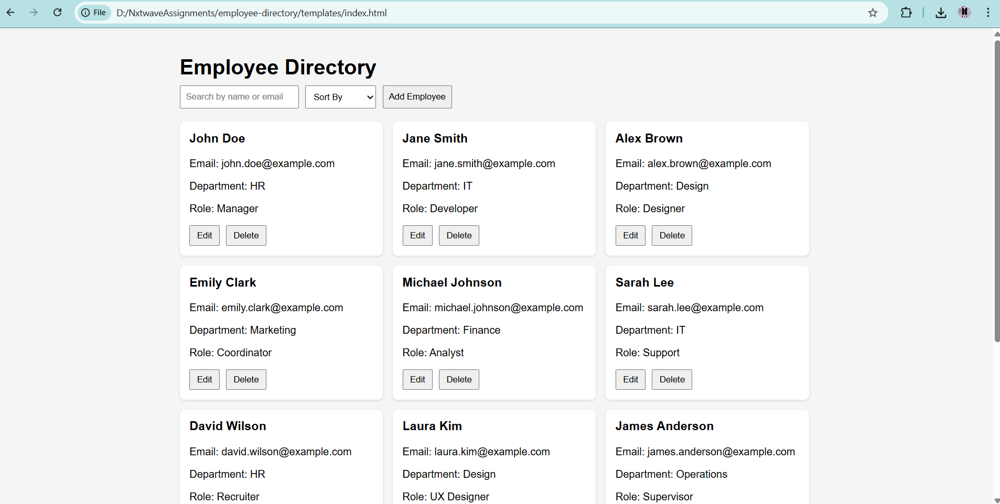
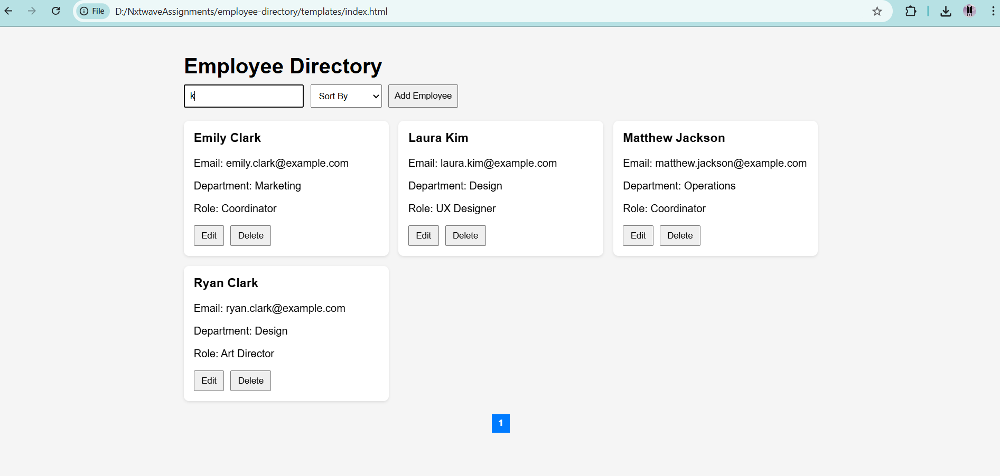
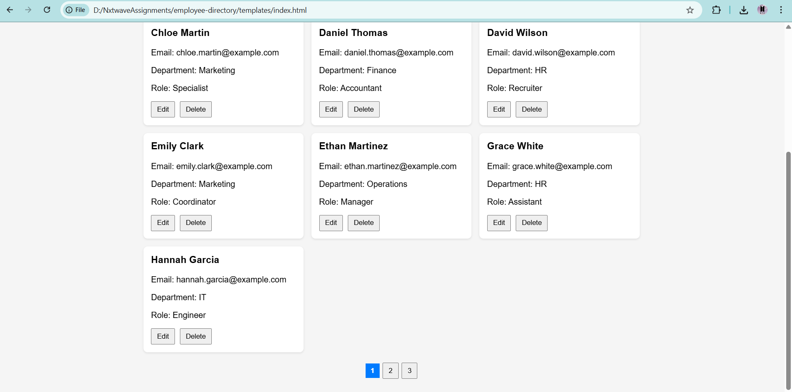
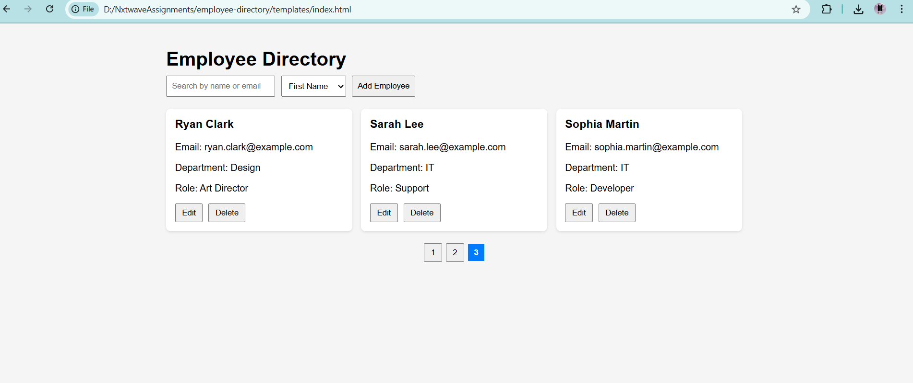
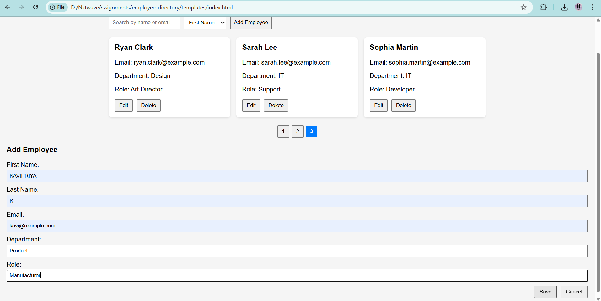

## Employee Directory Web Interface

## Overview
A responsive, interactive Employee Directory using HTML, CSS, Vanilla JavaScript, and Freemarker templates. Data is handled locally via a JavaScript array.

## Structure
- `templates/index.ftlh`: Dashboard page (Freemarker template)
- `templates/add-edit.ftlh`: Form page for Add/Edit (Freemarker template)
- `static/css/style.css`: Styles
- `static/js/data.js`: Mock data
- `static/js/app.js`: Logic for rendering, form, search, sort, pagination

## Setup & Run
### Without Backend
1. Rename `templates/index.ftlh` → `index.html` and `templates/add-edit.ftlh` → `add-edit.html`.
2. Update `<link>` and `<script>`#  paths if necessary (`static/css/style.css`, `static/js/...`).
3. Open `index.html` in browser.

### With Freemarker
1. Include Freemarker dependency in your Java project (e.g., Spring Boot Starter Freemarker).
2. Place templates in `src/main/resources/templates` and static files in `src/main/resources/static`.
3. Create a controller to pass `employees` list to `index.ftlh` and optionally a single `employee` to `add-edit.ftlh`.
4. Run your web application and navigate to `http://localhost:8080/`.

## Features
- **Dashboard**: List/Grid of employee cards
- **Add/Edit/Delete**: Handle in-memory data
- **Search**: Filter by name or email
- **Sort**: By first name or department
- **Pagination**: Options of 10 per page (adjustable)
- **Responsive**: Works on desktop and mobile
- **Validation**: Required fields + email format

## Reflection
- **Challenges**: Managing combined search, sort, and pagination state. Ensuring responsiveness.
- **Improvements**: Add filter sidebar, infinite scroll, better styling/animations.

## 📸 Screenshots

### 🖥️ Dashboard View

### ➕ Add Employee Form

### ✏️ Edit Employee

### 🔍 Filter / Search

### 📱 Responsive Mobile View

